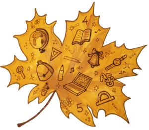
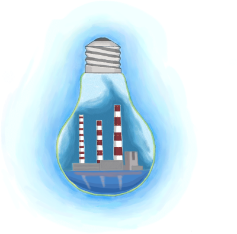
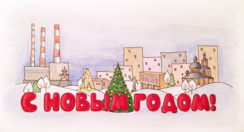
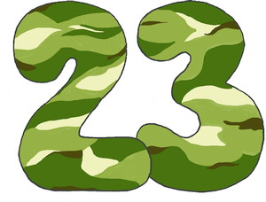
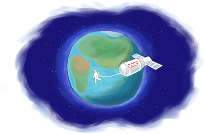

# vudlets
Картинки на праздники для [volgorechensk.ru](http://volgorechensk.ru)

Художник: Любовь Селезнёва

## 1 сентября, День знаний

## 13 сентября, День программиста

## 4 ноября, День народного единства

## 22 декабря, День энергетика

## Новый год и Рождество

## 14 февраля, День влюблённых

## 23 февраля, День защитника Отечества

## 8 марта, Международный женский день

## 12 апреля, День космонавтики

## 1 мая, Праздник Весны и Труда

## 9 мая, День Победы

## 1 июня, Международный день защиты детей

## 12 июня, День России

## 2 августа, День Воздушно-десантных войск
